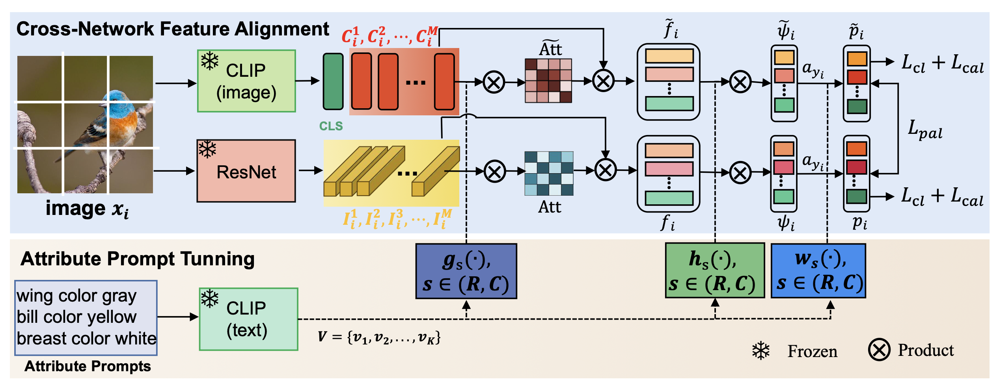

<div align="center">
<h1>APAN</h1>
<h3>Attribute Prompt Alignment Network for Zero-Shot Learning</h3>
</div>





## Requirements

The code implementation of **APAN** mainly based on [PyTorch](https://pytorch.org/). All of our experiments run and test in Python 3.8.15. To install all required dependencies:

```shell
$ pip install -r requirements.txt
```


## Backbones preparation

You can download pretrained backbone model, by clicking [CLIP ViT-B/16](https://openaipublic.azureedge.net/clip/models/5806e77cd80f8b59890b7e101eabd078d9fb84e6937f9e85e4ecb61988df416f/ViT-B-16.pt)
and [ResNet 101](https://download.pytorch.org/models/resnet101-63fe2227.pth). Pretrained backbone file show be placed here:

```
├─backbone_pretrained
   ├─CLIP
   │  └─ViT-B-16.pt
   └─ResNet
      └─resnet101-63fe2227.pth
```

## Datasets preparation
You can download datasets from [CUB](https://www.vision.caltech.edu/datasets/cub_200_2011/),  [SUN](https://cs.brown.edu/~gmpatter/sunattributes.html),  [AWA2](https://cvml.ista.ac.at/AwA2/)

Dataset files should be placed like below:

```
├─data
   ├─AWA2
   │  ├─Animals_with_Attributes2
   │  └─AWA2_full.pkl
   ├─CUB
   │  ├─CUB_200_2011
   │  └─CUB_full.pkl
   └─SUN
      ├─images
      └─SUN_full.pkl
```

## APAN pretrain model
Download the pretrained model on [Google Drive](https://drive.google.com/drive/folders/1xfgCau6j0SZM0ZPoq5Nfwc87HIHFIUp1?usp=share_link) and then put them here:
```
├─pretrined
   ├─AWA2
   │  ├─CZSL
   │  │  └─xxx.pth
   │  └─GZSL
   │     └─xxx.pth
   ├─CUB
   │  ├─CZSL
   │  │  └─xxx.pth
   │  └─GZSL
   │     └─xxx.pth
   └─SUN
      ├─CZSL
      │  └─xxx.pth
      └─GZSL
         └─xxx.pth
```

## Test model

```shell
$ python3 test.py -p path/to/pretrained_model
```